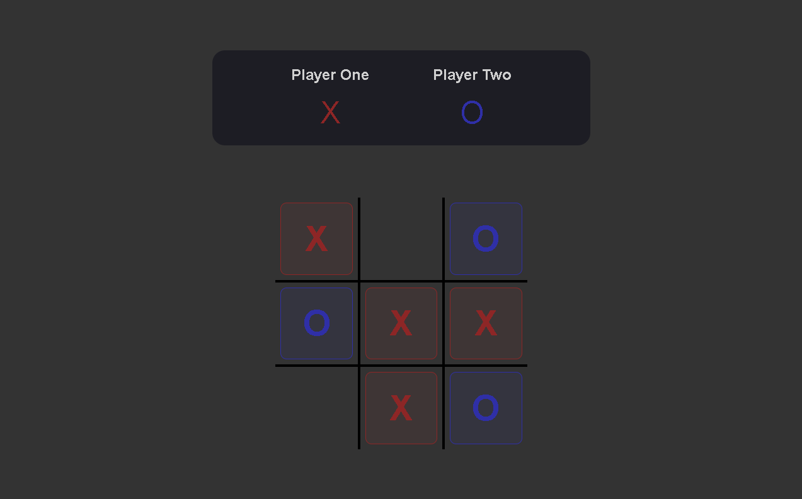

# ❌⭕ Tic Tac Toe

Projeto desenvolvido a partir do desafio de **Tic Tac Toe** do [The Odin Project](https://www.theodinproject.com?utm_source=chatgpt.com) com foco em praticar **JavaScript modular**, **Factory Functions**, **Module Pattern**, manipulação de DOM e gerenciamento de estado da aplicação.

---

<div align="center">

# 🎮 Tic Tac Toe

Um jogo da velha moderno, responsivo e totalmente interativo.



</div>

---

## 🔗 Links

<div align="center">

🌐 **Live Site**
[Live Preview](https://anaclarissi.github.io/tictac-toe/)

💻 **Repository**
[GitHub Repository](https://github.com/anaClarissi/tictac-toe)

🎯 **The Odin Project Challenge**
[Tic Tac Toe Project](https://www.theodinproject.com/lessons/node-path-javascript-tic-tac-toe)

🐙 **GitHub Profile**
[Ana Clarissi GitHub](https://github.com/anaClarissi)

</div>

---

## 📖 About The Project

O projeto consiste em um jogo da velha totalmente funcional onde os jogadores podem:

* Escolher seus nomes
* Escolher os símbolos (`X` ou `O`)
* Jogar múltiplas rodadas
* Reiniciar a partida
* Visualizar o vencedor de forma dinâmica

Esse desafio foi excelente para praticar conceitos importantes de arquitetura JavaScript moderna, como:

* Factory Functions
* Module Pattern
* Encapsulamento
* Gerenciamento de estado
* Manipulação dinâmica do DOM
* Separação entre lógica e interface

---

## ✨ Features

✅ Escolha personalizada de nome dos jogadores
✅ Escolha de símbolo (`X` ou `O`)
✅ Sistema completo de vitória e empate
✅ Overlay de resultado da partida
✅ Botão de continuar mantendo os jogadores
✅ Botão de restart completo
✅ Interface responsiva
✅ Estrutura modular em JavaScript
✅ Renderização dinâmica do tabuleiro
✅ Destaque visual para o jogador vencedor

---

## 🛠️ Technologies Used

<div align="left">


</div>

* **HTML5**
* **CSS3**
* **JavaScript**
* **Factory Functions**
* **Module Pattern**
* **Flexbox**
* **CSS Variables**
* **DOM Manipulation**

---

## 📂 Project Structure

```bash id="kz83lx"
tictac-toe/
│
├── src/
│   ├── css/
│   │   └── style.css
│   │
│   └── js/
│       └── tic-tac-toe.js
│
├── index.html
├── preview.png
└── README.md
```

---

## 🧠 What I Learned

Durante esse projeto pratiquei conceitos fundamentais para aplicações JavaScript mais organizadas:

* Criação de Factory Functions
* Uso de Module Pattern
* Encapsulamento de estado
* Manipulação dinâmica do DOM
* Controle de fluxo do jogo
* Separação entre lógica e interface
* Gerenciamento de eventos
* Estruturação de aplicações modulares
* Reset parcial e total de estados
* Organização de código escalável

---

## 📱 Responsive Design

O projeto foi desenvolvido para funcionar corretamente em:

* 📲 Tablet
* 💻 Desktop
* 🖥️ Large Screens

---

## 🚀 Future Improvements

* Adicionar modo Player vs CPU
* Implementar placar entre partidas
* Criar animações de vitória
* Destacar linha vencedora
* Adicionar efeitos sonoros
* Implementar Local Storage
* Criar modo dark/light theme
* Adicionar dificuldade para IA

---

## 🙌 Credits

Projeto desenvolvido como parte do currículo do [The Odin Project](https://www.theodinproject.com?utm_source=chatgpt.com).

### 🎯 Original Challenge

[Tic Tac Toe - The Odin Project](https://www.theodinproject.com/lessons/node-path-javascript-tic-tac-toe)

---

## 👩‍💻 Developed By

# Ana Clarissi

<div align="left">

<a href="https://github.com/anaClarissi">
  
</a>

</div>

🐙 GitHub:
[Ana Clarissi GitHub](https://github.com/anaClarissi)
